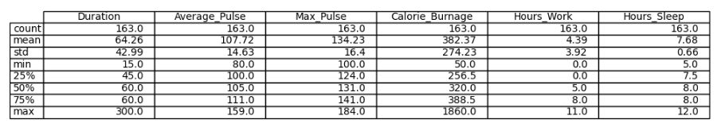

# Intro to Statistics

## Introduction
- Statistics is the science of analyzing data.
- When we have created a model for prediction, we must assess the prediction's reliability.
- After all, what is a prediction worth, if we can not rely on it?

## Descriptive Statistics
- Descriptive statistics summarizes important features of a data such as:
  - **Count**
  - **Sum**
  - **Standard Deviation**
  - **Percentile**
  - **Average**
- We can use `describe()` function in Python to summarize the data.
- **Code**
  ```python
    import pandas as pd

    full_health_data = pd.read_csv("data.csv", header=0, sep=",")

    pd.set_option('display.max_columns',None)
    pd.set_option('display.max_rows',None)

    print (full_health_data.describe())
  ```
- **Output**
  