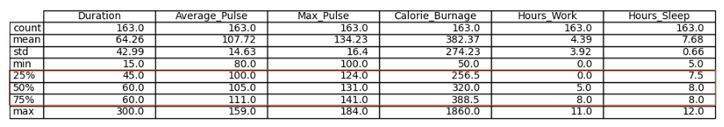

# Statistics Percentiles
## 25%, 50% and 75% - Percentiles
- Percentiles are used in statistics to give us a number that describes the value that a given percent of the values are lower than
- **Figure**
    
- **Explanation**
  - The 25% percentile of `Average_Pulse` means that 25% of all of the training sessions have an average pulse of 100 beats per minute or lower.
  - If we flip the statement, it means that 75% of all of the training sessions have an average pulse of 100 beats per minute or higher.
  - The 75% percentile of `Average_Pulse` means that, 75% of all the training sessions have an average pulse of 111 or lower. 
  - If we flip the statement, it means that 25% of all of the training sessions have an average pulse of 111 beats per minute or higher.
  - [Click here for code](stat_percentils.ipynb)