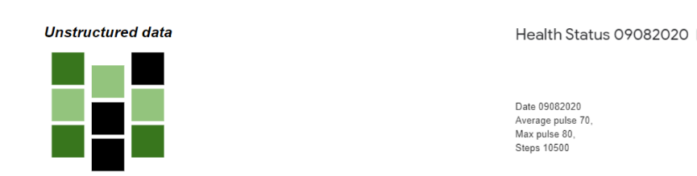
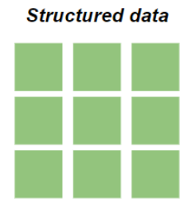

## What is Data?
- Data is a collection of information.
- One purpose of Data Science is to structure data, making it interpretable and easy to work with.
- Data can be categorized into two groups:
  - Structured data.
  - Unstructured data.

## Unstructured Data vs Structured Data

| Unstructured Data  | Structured Data |
| -------------      | ------------- |
| Unstructured data is not organized. We must organize the data for analysis purposes.      | Structured data is organized and easier to work with.  |
|        |   |

## How to strcuture Data?
- We can use an array or a database table to structure or present data.
- For example, an array

```python
weights = [80, 85, 90, 95, 100, 105, 110, 115, 120, 125]
print(weights)
```