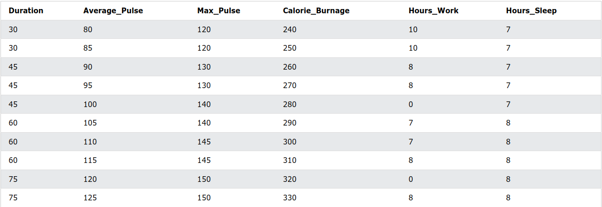
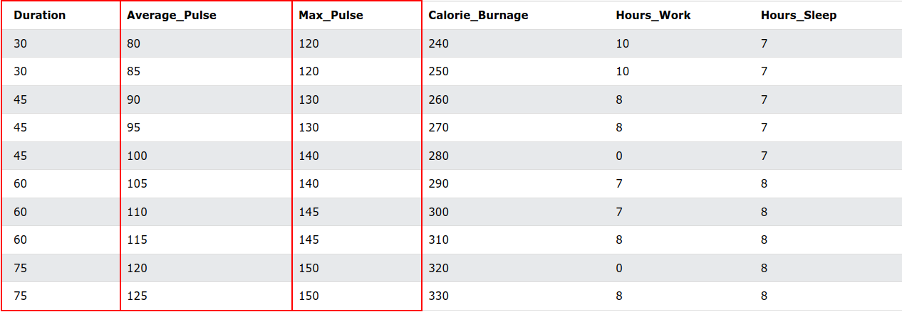

## Database Table
- It is a table with structured data.
- This dataset containing information of a typical session such as duration, average pulse, calorie burnage etc.
- e.g.: the following table shows a database table with health data extracted from a sports watch

## Database Table Structure
- A table consists of rows and columns.
- A row is a horizontal representation of data.
- A column is a vertical representation of data.

## Variables
- A variable is defined as something that can be measured or counted.
- Examples can be characters, numbers or time.
- e.g.: we can observe that each column represents a variable
    