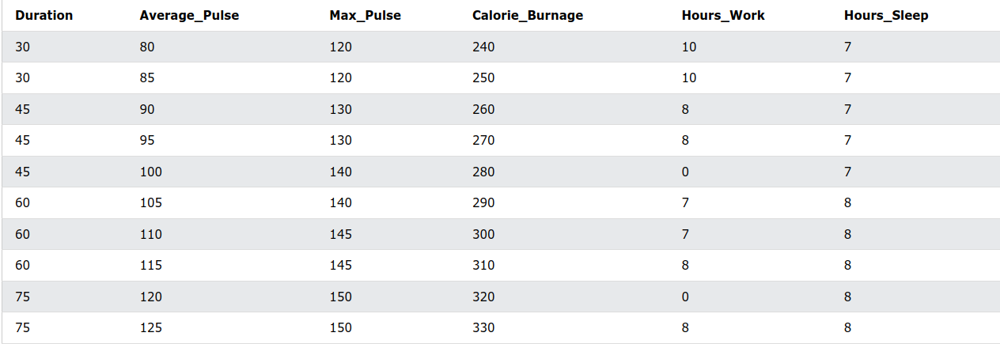

# DS Functions: min(), max(), mean() -> Numpy

## Sports Watch Data Set

- The dataset contains 6 variables each with 10 observations:
  - **Duration:** How long lasted training session in minutes?
  - **Average_Pulse:** What was the average pulse of the training session? This is measured by beats per minute.
  - **Max_Pulse:** What was the max pulse of the training session?
  - **Calorie_Burnage:** How much calories were burnt on the training session?
  - **Hours_Work:** How many hours did we work at our job before the training session?
  - **Hours_Sleep:** How much did we sleep the night before the training session?
- We use underscore (_) to separate strings because Python cannot read space as separator.
- [Code is explained here](ds_fuctions.ipynb)